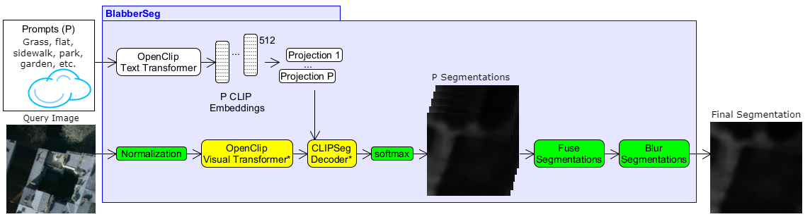
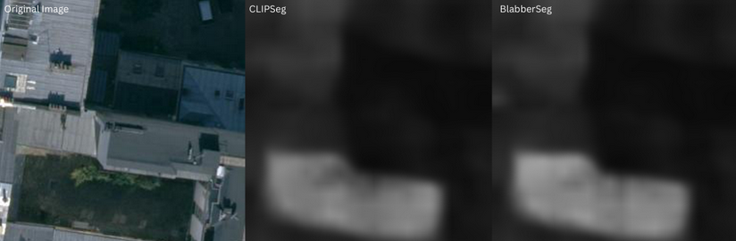

# BlabberSeg :speech_balloon::Optimization by Reusing Features for Real-Time On-Device Open-Vocabulary Aerial Segmentation

## About
BlabberSeg is a novel reusing architecture that extends CLIPSeg (https://arxiv.org/abs/2112.10003) to unlock computational efficiency during exploration of safe landing zone segmentation.

## Application
Existing models require massive computation which is a limitation in real-time applications. For our model, the enhancement comes from reusing features to mitigate excessive computational 
overhead and achieve real-time segmentationOur approach can be extended to other open-vocabulary segmentation models. To validate our methodology, we employed it in safe landing context
using the recent paper DOVESEI’s setting (https://arxiv.org/abs/2308.11471), which presented a streamlined reactive UAV system utilizing visual servoing and leveraging open-vocabulary 
image segmentation.

## Quickstart
This was only tested on Jetson Orin AGX. Dependencies may vary and reinstalling versions (Python3, torch, torchvision, etc.) might be required.

## Docker Image for Jetson Orin AGX and DOVESEI
docker run --runtime nvidia -it --rm --network=host --volume="$HOME/.Xauthority:/root/.Xauthority:rw" -e DISPLAY=$DISPLAY -v $(pwd):/home haechanmarkbong/blabberseg

### Generate CLIPSeg Modification Backbones
mkdir CLIPActivations  
cd int8_quant_dataset  
mkdir segmentations  
cd segmentations  
mkdir {name of the optimized model (see scripts for the models)}  
cd /home  
python3 scripts/Generate\ CLIPSeg\ Mod\ Backbones.py

### Generate CLIP Activations & Conditonals
python3 scripts/Generate\ Activations\ and\ Conditionals.py

### Generate ONNX Models
mkdir onnx  
cd int8_quant_dataset  
mkdir activations  
cd ..  
python3 scripts/ONNX\ model\ generation.py

### Simplify ONNX Models
cd onnx  
onnxsim CLIPActivations_fp16_352.onnx CLIPActivations_fp16_352_simpl.onnx  
onnxsim CLIPSegDecoder_fp16_352.onnx CLIPSegDecoder_fp16_352_simpl.onnx

### TensorRT Engine
trtexec --onnx=CLIPActivations_fp16_352_simpl.onnx --saveEngine=CLIPActivations.trt --workspace=128 --fp16 --verbose --best  
trtexec --onnx=CLIPSegDecoder_fp16_352_simpl.onnx --saveEngine=CLIPSegDecoder.trt --workspace=128 --fp16 --verbose --best

### Test without DOVESEI
cd ..  
python3 scripts/CLIPSeg_Mod_TensorRT_IOBinding_Dovesei.py

### Testing using DOVESEI 
git clone --recurse-submodules https://github.com/MISTLab/DOVESEI.git  
colcon build --symlink-install --packages-select ros2_satellite_aerial_view_simulator ros2_open_voc_landing_heatmap ros2_open_voc_landing_heatmap_srv  
source install/setup.bash  
Change this file with the one in this repo.:   
src/ros2_open_voc_landing_heatmap/ros2_open_voc_landing_heatmap/generate_landing_heatmap.py  
cd src/ros2_satellite_aerial_view_simulator  
pip install --use-pep517 ros2_satellite_aerial_view_simulator  
ros2 launch ros2_open_voc_landing_heatmap start_aerialview.launch.py

## The Reusing Architecture
### Reusing Features
- Conditionals
- CLIP Activations
- FiLM
- Image Encoding
- Positional Embeddings
- Image (multi-prompts/image)

## Hardware Acceleration
In order to facilitate reproducible experiments, all tests are done in Nvidia Jetson Orin AGX 64GB, NX 16GB, Nano 8GB, AGX Xavier 64GB and Google Colab. Using Orin AGX, Orin NX and Nano were emulated for performance comparison.
Other than the reusing methods, we accelerated our model using TensorRT and ONNX runtime input/output binding, taking advantage of efficient hardware acceleration. In addition, our model
integrated OpenCLIP instead of the original CLIP to address precision-related challenges by casting our model with float16. The internal cast to float32 in CLIP can disrupt compatibility
with float16, making it challenging to operate with different precisions. OpenCLIP provides a solution that enables seamless casting of the entire model to float16, enhancing flexibility
without compromising precision.

## Performance
Compared to the usage of original CLIPSeg, our model was able to increase the computation speed to 1261.09% for Jetson Orin AGX, respectively.

## Publication
For more information about BlabberSeg, refer to our paper: .
